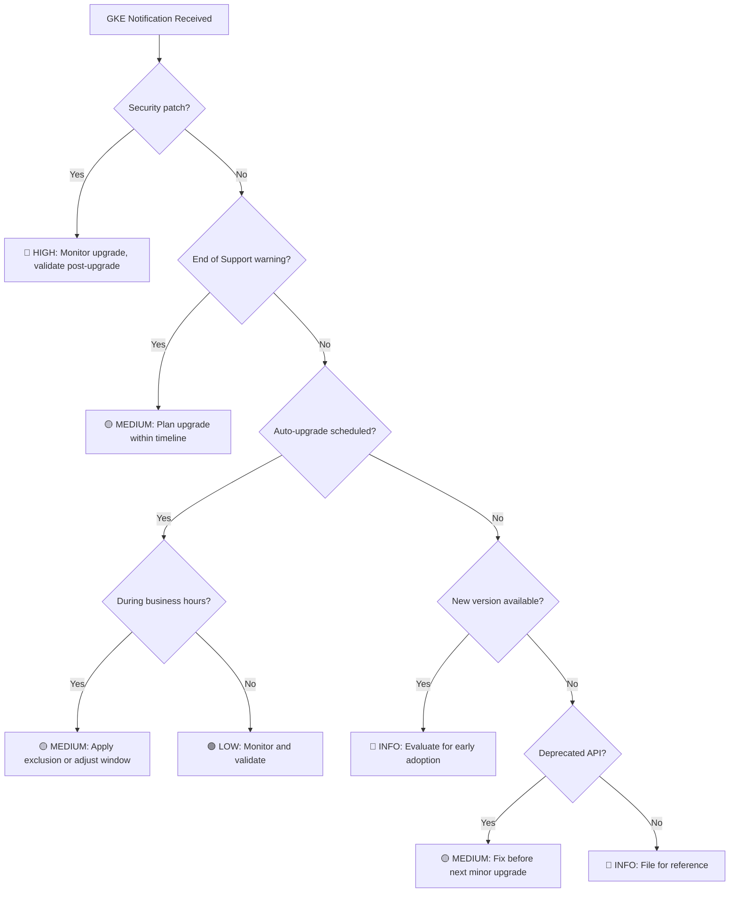

# GKE Upgrade Notification Triage System

I'll help you create a systematic approach to handle GKE upgrade notifications based on urgency and required action.

## Notification Classification Matrix

| Notification Type | Urgency | Action Required | Timeline | Response |
|------------------|---------|----------------|----------|----------|
| **Security patches (auto-upgrade)** | 🔴 High | Monitor/Validate | 7-14 days | Ensure maintenance windows allow upgrade |
| **End of Support (EoS) warnings** | 🟡 Medium-High | Plan upgrade | 30-90 days | Schedule manual upgrade or configure exclusions |
| **Auto-upgrade scheduled** | 🟢 Low | Monitor | 72 hours | Verify timing works, apply exclusion if needed |
| **New version available** | 🔵 Info | Optional | No deadline | Evaluate for manual upgrade acceleration |
| **Deprecated API usage** | 🟡 Medium | Fix before next minor | Before EoS | Update manifests/applications |
| **Maintenance window conflicts** | 🟡 Medium | Reschedule | Before auto-upgrade | Adjust windows or apply temporary exclusion |

## Triage Decision Tree



## Action Playbooks by Notification Type

### 🔴 Security Patch Auto-Upgrades

**Sample notification:** "Security patch 1.29.8-gke.1031000 will be applied to cluster 'prod-cluster' in Regular channel"

**Required actions:**
1. **Verify maintenance window allows upgrade**
   ```bash
   gcloud container clusters describe CLUSTER_NAME --zone ZONE \
     --format="value(maintenancePolicy)"
   ```
2. **Monitor the upgrade (don't block it unless critical)**
3. **Post-upgrade validation within 24 hours**
   - Check application health
   - Verify no degraded services
   - Monitor error rates

**When to intervene:** Only apply a "no upgrades" exclusion if:
- Critical production deployment in progress
- Known compatibility issues with the patch
- Major business event (Black Friday, etc.)

### 🟡 End of Support (EoS) Warnings

**Sample notification:** "Kubernetes version 1.28 reaches End of Support on 2024-XX-XX. Upgrade cluster 'prod-cluster' before automatic enforcement."

**Action timeline:**
- **90 days before EoS:** Add to quarterly planning
- **30 days before EoS:** Schedule upgrade or configure exclusions
- **7 days before EoS:** Execute upgrade or apply temporary exclusion

**Response options:**
```bash
# Option 1: Schedule manual upgrade
gcloud container clusters upgrade CLUSTER_NAME \
  --zone ZONE \
  --cluster-version TARGET_VERSION

# Option 2: Migrate to Extended channel (24-month support, extra cost)
gcloud container clusters update CLUSTER_NAME \
  --zone ZONE \
  --release-channel extended

# Option 3: Apply "no upgrades" exclusion (max 30 days, buys time)
gcloud container clusters update CLUSTER_NAME \
  --zone ZONE \
  --add-maintenance-exclusion-name "eos-deferral" \
  --add-maintenance-exclusion-start-time $(date -Iseconds) \
  --add-maintenance-exclusion-end-time $(date -d "+30 days" -Iseconds) \
  --add-maintenance-exclusion-scope no_upgrades
```

### 🟢 Auto-Upgrade Scheduled Notifications

**Sample notification:** "Cluster 'prod-cluster' scheduled for auto-upgrade to 1.29.9-gke.1031000 on 2024-XX-XX between 02:00-06:00 UTC"

**Evaluation criteria:**
- ✅ **Allow if:** Outside business hours, in maintenance window, low-risk patch
- ❌ **Block if:** Business hours, critical deployment, insufficient testing

**Quick response (if blocking needed):**
```bash
# Apply 7-day "no upgrades" exclusion to defer
gcloud container clusters update CLUSTER_NAME \
  --zone ZONE \
  --add-maintenance-exclusion-name "scheduled-deferral" \
  --add-maintenance-exclusion-start-time $(date -Iseconds) \
  --add-maintenance-exclusion-end-time $(date -d "+7 days" -Iseconds) \
  --add-maintenance-exclusion-scope no_upgrades
```

### 🔵 New Version Available

**Sample notification:** "Kubernetes 1.30.5-gke.1032000 now available in Regular channel"

**Evaluation for early adoption:**
- **Accelerate if:** Contains fix for known issue affecting your workloads
- **Wait if:** No compelling features, auto-upgrade cadence is acceptable
- **Test in staging first:** Always validate new versions in non-prod

### 🟡 Deprecated API Usage Warnings

**Sample notification:** "Cluster 'prod-cluster' uses deprecated API extensions/v1beta1 Ingress. Update before Kubernetes 1.32."

**Action required:** Fix before the next minor version upgrade
```bash
# Identify deprecated API usage
kubectl get --raw /metrics | grep apiserver_request_total | grep deprecated

# Use GKE deprecation insights dashboard for detailed breakdown
```

## Notification Management Setup

### 1. Email Filtering Rules

Create email rules based on subject patterns:

| Subject Contains | Label/Folder | Priority |
|-----------------|-------------|----------|
| "security patch" | GKE-Security | High |
| "end of support" | GKE-EoS | Medium |
| "scheduled for upgrade" | GKE-Scheduled | Low |
| "available in" | GKE-Available | Info |
| "deprecated" | GKE-Deprecated | Medium |

### 2. Team Responsibility Matrix

| Notification Type | Primary Owner | Secondary | SLA |
|------------------|--------------|-----------|-----|
| Security patches | Platform Team | SRE | Monitor within 2 hours |
| EoS warnings | Platform Team | Engineering Manager | Plan within 1 week |
| Scheduled upgrades | On-call Engineer | Platform Team | Evaluate within 4 hours |
| Available versions | Platform Team | None | Review weekly |
| Deprecated APIs | Application Teams | Platform Team | Fix within sprint |

### 3. Escalation Triggers

**Immediate escalation (page on-call):**
- Security patch upgrade fails
- Auto-upgrade causes service degradation
- EoS enforcement begins without plan

**Next business day escalation:**
- Multiple notifications for same cluster
- Maintenance window conflicts
- Unexpected upgrade behavior

## Recommended Notification Configuration

```bash
# Enable scheduled upgrade notifications (72h advance notice)
gcloud container clusters update CLUSTER_NAME \
  --zone ZONE \
  --enable-scheduled-upgrade-notifications

# Configure notification channels (Cloud Monitoring)
gcloud alpha monitoring channels create \
  --display-name "GKE Upgrades" \
  --type email \
  --channel-labels email_address=your-team@company.com
```

## Weekly Review Process

**Every Monday, review:**
1. **Upcoming scheduled upgrades** (next 7 days)
2. **EoS timelines** (next 90 days) 
3. **Failed or stuck upgrades** from previous week
4. **Deprecated API usage** reports
5. **Channel strategy** - are clusters on appropriate channels?

**Monthly review:**
1. **Upgrade cadence analysis** - are we keeping up?
2. **Maintenance window optimization** - reduce business hour conflicts
3. **Notification fatigue** - tune alert thresholds
4. **Release channel alignment** - dev/staging/prod progression

## Quick Reference Commands

```bash
# Check all cluster auto-upgrade status
gcloud container clusters list --format="table(name,zone,releaseChannel.channel,currentMasterVersion)"

# View current maintenance exclusions
gcloud container clusters describe CLUSTER_NAME --zone ZONE \
  --format="yaml(maintenancePolicy.window.maintenanceExclusions)"

# Check upgrade info (target versions, EoS dates)
gcloud container clusters get-upgrade-info CLUSTER_NAME --region REGION

# Monitor active operations
gcloud container operations list --cluster CLUSTER_NAME --zone ZONE \
  --filter="operationType:(UPGRADE_MASTER OR UPGRADE_NODES)" \
  --limit=5
```

This triage system will help you focus on notifications that require immediate action while staying informed about routine maintenance. The key is to **default to allowing auto-upgrades** (GKE's core value) and only intervene when there's a specific business or technical reason to defer.