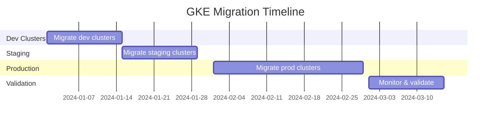

You're facing a common challenge with legacy GKE configurations. Let me break down what you're missing and provide a clear migration path.

## What You're Missing with "No Channel"

### 1. **Predictable Upgrade Windows**
- **Current pain**: Google forces upgrades when your version approaches end-of-life
- **With channels**: You get predictable, staged rollouts with advance notice

### 2. **Automatic Security Patches**
- **Current**: Manual intervention required for security updates
- **With channels**: Critical security patches applied automatically within maintenance windows

### 3. **Reduced Operational Overhead**
- **Current**: Constant monitoring of version lifecycle and manual upgrade planning
- **With channels**: Automated management with safety rails

### 4. **Better Testing Pipeline**
- **Current**: Limited ability to test upcoming versions
- **With channels**: Can test on Rapid → promote to Regular → promote to Stable

## Release Channel Options

```yaml
# Channel characteristics
Rapid:    # New K8s versions ~4-6 weeks after upstream
  - Latest features
  - Higher change frequency
  - Good for dev/testing

Regular:  # New K8s versions ~2-3 months after upstream  
  - Balanced stability/features
  - Most popular choice
  - Good for staging/production

Stable:   # New K8s versions ~4-5 months after upstream
  - Maximum stability
  - Slower feature adoption
  - Good for critical production workloads
```

## Migration Strategy

### Phase 1: Assessment & Planning
```bash
# Audit current cluster versions
gcloud container clusters list --format="table(name,location,currentMasterVersion,currentNodeVersion,releaseChannel.channel)"

# Check node pool upgrade status
gcloud container node-pools list --cluster=CLUSTER_NAME --zone=ZONE
```

### Phase 2: Choose Your Channel Strategy
For your situation, I recommend:
- **Development clusters**: Regular channel
- **Staging clusters**: Regular channel  
- **Production clusters**: Stable channel

### Phase 3: Migration Execution

#### Option A: In-Place Migration (Recommended)
```bash
# 1. Enable release channel on existing cluster
gcloud container clusters update CLUSTER_NAME \
    --zone=ZONE \
    --release-channel=stable

# 2. Update node pools to match
gcloud container node-pools update NODEPOOL_NAME \
    --cluster=CLUSTER_NAME \
    --zone=ZONE
```

#### Option B: Blue-Green Migration (Safest for Production)
```bash
# 1. Create new cluster with release channel
gcloud container clusters create new-cluster \
    --zone=ZONE \
    --release-channel=stable \
    --cluster-version=1.31 \
    --num-nodes=3

# 2. Migrate workloads using your preferred method
# 3. Update DNS/load balancers
# 4. Decommission old cluster
```

## Recommended Migration Timeline



## Implementation Steps

### 1. **Start with Non-Production**
```bash
# Dev cluster migration
gcloud container clusters update dev-cluster-1 \
    --zone=us-central1-a \
    --release-channel=regular \
    --maintenance-window-start=2024-01-15T02:00:00Z \
    --maintenance-window-end=2024-01-15T06:00:00Z \
    --maintenance-window-recurrence='FREQ=WEEKLY;BYDAY=SU'
```

### 2. **Configure Maintenance Windows**
```yaml
# maintenance-policy.yaml
apiVersion: v1
kind: ConfigMap
metadata:
  name: maintenance-policy
data:
  policy: |
    maintenancePolicy:
      window:
        recurringWindow:
          window:
            startTime: "2024-01-15T02:00:00Z"
            endTime: "2024-01-15T06:00:00Z"
          recurrence: "FREQ=WEEKLY;BYDAY=SU"
```

### 3. **Set Up Monitoring**
```bash
# Create alerts for cluster upgrades
gcloud alpha monitoring policies create \
    --policy-from-file=cluster-upgrade-alert.yaml
```

## Risk Mitigation

### Pre-Migration Checklist
- [ ] Backup all cluster configurations
- [ ] Document current workload requirements  
- [ ] Test application compatibility with target K8s version
- [ ] Prepare rollback procedures
- [ ] Set up enhanced monitoring

### During Migration
- [ ] Monitor cluster health metrics
- [ ] Validate workload functionality
- [ ] Check resource utilization
- [ ] Verify networking/ingress functionality

## Immediate Next Steps

1. **This week**: Audit all 8 clusters and document current state
2. **Next week**: Choose target release channels per environment
3. **Week 3**: Migrate first development cluster as pilot
4. **Week 4**: Evaluate pilot results and refine process

Since you're already at 1.31, you're in a good position to migrate without forced upgrades breathing down your neck. The key is moving systematically and leveraging the predictability that release channels provide.

Would you like me to help you create specific migration scripts for your clusters or dive deeper into any of these areas?