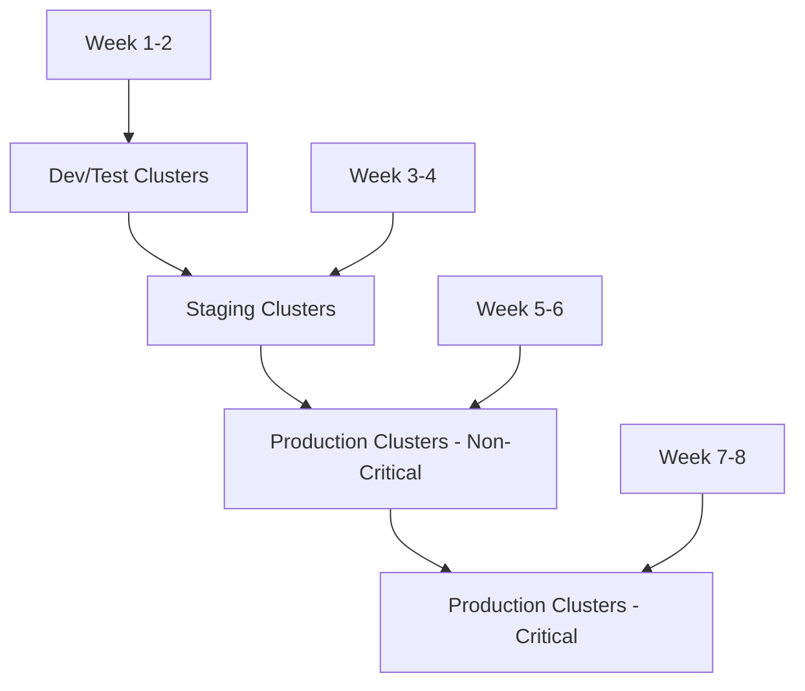

You're facing significant operational challenges by staying on the legacy "No channel" configuration. Here's what you need to know:

## What You're Missing on "No Channel"

### 1. **Predictable Update Patterns**
- **Current pain**: Random forced upgrades with little warning
- **With channels**: Controlled, predictable release schedule with advance notice

### 2. **Automated Security Patching**
- **Current pain**: Manual security updates, potential exposure windows
- **With channels**: Automatic security patches within your chosen stability level

### 3. **Reduced Maintenance Overhead**
- **Current pain**: Constant firefighting with upgrade issues
- **With channels**: Automated maintenance windows, gradual rollouts

### 4. **Better Support and Documentation**
- **Current pain**: Limited support for static versions
- **With channels**: Full Google support, comprehensive upgrade guides

## Release Channel Options

```yaml
# Rapid Channel - Latest features, weekly updates
channel: "RAPID"
# Regular Channel - Balanced, ~monthly updates  
channel: "REGULAR"
# Stable Channel - Production-focused, quarterly updates
channel: "STABLE"
```

**Recommendation for your platform**: Start with **Stable** channel for production workloads.

## Migration Strategy

### Phase 1: Assessment & Planning
```bash
# Check current cluster versions
gcloud container clusters list --format="table(name,location,currentMasterVersion,currentNodeVersion,releaseChannel.channel)"

# Verify workload compatibility
kubectl get nodes -o wide
kubectl get pods --all-namespaces -o jsonpath='{range .items[*]}{.spec.containers[*].image}{"\n"}{end}' | sort | uniq
```

### Phase 2: Migration Path (Recommended Order)

**Option A: In-place Channel Assignment**
```bash
# For each cluster (start with non-production)
gcloud container clusters update CLUSTER_NAME \
    --location=LOCATION \
    --release-channel=stable
```

**Option B: Blue-Green Migration** (Safer for critical workloads)
```bash
# Create new cluster with channel
gcloud container clusters create new-cluster \
    --location=us-central1-a \
    --release-channel=stable \
    --cluster-version=1.31 \
    # ... other configs
```

### Phase 3: Rollout Plan



## Pre-Migration Checklist

### 1. **Workload Compatibility Assessment**
```bash
# Check for deprecated APIs
kubectl get apiservices
kubectl get customresourcedefinitions

# Review pod security policies
kubectl get psp
```

### 2. **Backup Strategy**
```bash
# ETCD backup (if using custom configs)
# Application data backup
# Configuration backup
kubectl get configmaps,secrets --all-namespaces -o yaml > cluster-configs-backup.yaml
```

### 3. **Monitoring Setup**
```yaml
# Set up monitoring for migration
apiVersion: monitoring.coreos.com/v1
kind: ServiceMonitor
metadata:
  name: gke-upgrade-monitoring
spec:
  # Monitor cluster health during migration
```

## Post-Migration Benefits You'll Gain

### 1. **Maintenance Windows**
```yaml
# Configure maintenance windows
maintenancePolicy:
  window:
    dailyMaintenanceWindow:
      startTime: "03:00"
    # Or recurring windows
    recurringWindow:
      window:
        startTime: "2024-01-15T03:00:00Z"
        endTime: "2024-01-15T07:00:00Z"
      recurrence: "FREQ=WEEKLY;BYDAY=SU"
```

### 2. **Node Auto-Upgrade Control**
```bash
# Enable node auto-upgrade with channels
gcloud container node-pools update POOL_NAME \
    --cluster=CLUSTER_NAME \
    --location=LOCATION \
    --enable-autoupgrade
```

### 3. **Surge Upgrade Configuration**
```bash
# Control upgrade disruption
gcloud container node-pools update POOL_NAME \
    --max-surge-upgrade=2 \
    --max-unavailable-upgrade=1
```

## Risk Mitigation

### 1. **Test Environment First**
- Migrate 1-2 dev clusters initially
- Run full application test suites
- Monitor for 2-4 weeks

### 2. **Gradual Production Rollout**
- Start with least critical production workloads
- Implement blue-green deployments for critical services
- Have rollback procedures ready

### 3. **Communication Plan**
```yaml
# Example notification setup
notifications:
  - type: "upgrade-available"
    channels: ["slack", "email"]
    advance_notice: "7 days"
```

## Immediate Next Steps

1. **Week 1**: Choose 1-2 non-critical clusters for pilot migration to Stable channel
2. **Week 2**: Monitor pilot clusters, document any issues
3. **Week 3**: Create migration runbooks based on pilot experience
4. **Week 4+**: Begin systematic migration of remaining clusters

The migration will significantly reduce your operational burden and provide much better predictability for your platform operations. The key is starting small and building confidence through the process.

Would you like me to help you create specific migration scripts for your environment or dive deeper into any particular aspect?